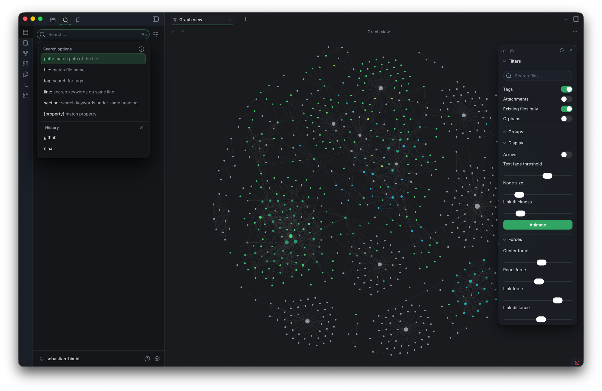
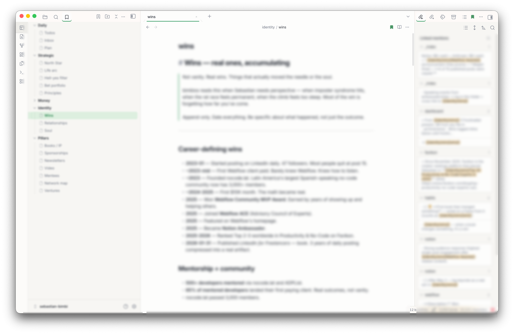

# Liquid

**The glass-aesthetic Obsidian theme.** macOS Tahoe Liquid Glass, ported to your second brain.

> Translucent panels over your wallpaper. Forest green on hue 146°. WCAG AA in both modes.<br>
> Retheme everything by changing one CSS variable.


[](https://linkedin.com/in/sebasbimbi)





## Why Liquid

- **Real glass, not faux.** 48 surfaces use `backdrop-filter` with calibrated blur and saturate. Your wallpaper bleeds through every panel, modal, and toast.
- **One-variable retheme.** `--bb-accent-h: 146` is the source of truth. Change it to 25 (amber), 220 (cobalt), 280 (plum), or any hue from 0 to 360. Every accent regenerates.
- **Honest light mode.** Not inverted dark. Separately tuned tints, edges, shadows, and a syntax palette balanced for cream-tinted backgrounds.
- **Crisp motion.** Exponential ease-out at 120–200ms. No bounce, no spring, no settle.
- **AA contrast on every accent.** Buttons, tags, active rows, focus rings — all pass in both modes.
- **System-respectful.** Honors `prefers-reduced-motion` and `prefers-reduced-transparency`. Stays clear of macOS traffic lights and leans into native vibrancy.
- **Fully tokenized.** Every color, blur, radius, and motion curve is a CSS variable. Override anything in a snippet without touching the theme.

If you've ever wished Obsidian felt like a first-party macOS app, this is that. If you want it to feel like *your* app, change one number and the whole thing shifts.

## Install

### Manual

1. Download `theme.css` and `manifest.json` from this repo (or clone it).
2. Drop them into `<your-vault>/.obsidian/themes/Liquid/` (create the folder if needed).
3. Obsidian → Settings → Appearance → Themes → select **Liquid**.
4. **For full effect:** Settings → Appearance → Translucent window → ON.

### Via Obsidian (when published to community themes)

Settings → Appearance → Themes → Manage → search **Liquid** → Install → Use.

## What it looks like

| Surface | Material |
|---|---|
| Tab bar | Soft-rounded tabs with accent under-stripe on active |
| Sidebar | Translucent strip over your wallpaper |
| Modals + quick-switcher | Strong glass with backdrop blur, elevated shadow |
| Active file in tree | Accent glass pill — always the loudest pixel |
| Notice toasts | Floating glass capsules, bottom-right |
| Code blocks | Glass card with forest-friendly syntax palette |
| Tables, embeds, callouts | Glass cards |

## Design principles

12 principles drive every pixel. Short version:

1. Forest green accent, hue 146° — refined, never highlighter
2. Liquid Glass IS the chrome — applied uniformly, not as decoration
3. Honest hierarchy: active > hover > default; quiet by default
4. Tinted neutrals only — never pure `#fff` or `#000`
5. WCAG AA contrast on every interactive accent
6. Real motion — 120-200ms exponential ease-out, no bounce
7. Generous corner radii — continuous-corners feel
8. Single source of truth for spacing + glass via CSS variables
9. macOS-respectful — don't paint over traffic lights, lean into vibrancy
10. Absolute-positioned chevrons so files + folders share padding
11. Inner top-edge highlight + outer drop shadow on every floating panel
12. Print + reduced-motion + reduced-transparency all honored

## Customize

Liquid exposes a complete token system via CSS variables. To change anything, create a snippet in `<your-vault>/.obsidian/snippets/liquid-overrides.css`, enable it under **Settings → Appearance → CSS snippets**, and override the variables you need. Don't edit `theme.css` directly — your changes will be overwritten on update.

### Recolor everything with one variable

The whole accent palette derives from one hue. Drop this in a snippet:

```css
:root {
  --bb-accent-h: 146;  /* forest green (default) */
}
```

Try other hues:

| Vibe | Hue |
|---|---|
| Forest green (default) | `146` |
| Cobalt blue | `220` |
| Plum | `280` |
| Amber | `25` |
| Rose | `345` |
| Teal | `175` |

Change the hue and every token regenerates: file-active rings, focus indicators, tab stripes, callouts, tags, syntax keywords, button fills, hover hints. One line, full retheme.

### Tune the glass material

```css
:root {
  /* Blur strength — lower for less haze, higher for more frost */
  --bb-glass-blur-soft:   12px;   /* tabs, soft surfaces */
  --bb-glass-blur-base:   24px;   /* sidebar, panels */
  --bb-glass-blur-strong: 40px;   /* modals, quick-switcher */

  /* Vibrancy — lower flattens color, higher pumps it up */
  --bb-glass-saturate: 180%;
}
```

### Tune corner radii

```css
:root {
  --bb-radius-xs: 4px;    /* small chips, ticks */
  --bb-radius-s:  6px;    /* buttons, micro-cards */
  --bb-radius-m:  10px;   /* tabs, settings rows */
  --bb-radius-l:  16px;   /* panels, modals */
  --bb-radius-xl: 22px;   /* hero surfaces */
}
```

### Tune motion

```css
:root {
  --bb-ease: cubic-bezier(0.25, 0.46, 0.45, 0.94);  /* exponential ease-out */
  --bb-duration-fast: 120ms;   /* hovers, focus rings */
  --bb-duration-base: 180ms;   /* panel/dropdown transitions */
  --bb-duration-slow: 260ms;   /* modal entrances */
}
```

### Tune dark / light specifics

Dark and light each have their own glass tints, edge colors, and shadow recipes. Override by scoping under `.theme-dark` or `.theme-light`:

```css
.theme-dark {
  --bb-glass-tint:        hsla(220, 14%, 13%, 0.62);
  --bb-glass-tint-strong: hsla(220, 14%, 13%, 0.78);
  --bb-glass-edge:        hsla(0, 0%, 100%, 0.05);
  --bb-glass-highlight:   hsla(0, 0%, 100%, 0.08);
}

.theme-light {
  --bb-glass-tint:        hsla(40, 30%, 99%, 0.78);
  --bb-glass-tint-strong: hsla(40, 30%, 99%, 0.90);
  --bb-glass-edge:        hsla(0, 0%, 0%, 0.08);
  --bb-glass-highlight:   hsla(0, 0%, 100%, 0.30);
}
```

### Tune the syntax palette

Code blocks use a forest-friendly palette. Each role is a single variable, scoped per theme:

```css
.theme-dark {
  --bb-syntax-keyword:    hsl(15, 60%, 65%);    /* coral — keyword/builtin */
  --bb-syntax-string:     hsl(146, 45%, 60%);   /* sage — strings */
  --bb-syntax-number:     hsl(35, 65%, 65%);    /* amber — numbers */
  --bb-syntax-function:   hsl(190, 50%, 65%);   /* cyan — functions */
  --bb-syntax-class:      hsl(280, 40%, 70%);   /* purple — classes/types */
  --bb-syntax-comment:    hsl(220, 8%, 50%);
  --bb-syntax-punctuation: hsl(220, 8%, 60%);
}
```

### Swap the typeface

By default the theme prefers [Inter](https://rsms.me/inter/) and [JetBrains Mono](https://www.jetbrains.com/lp/mono/) when installed locally, and falls back to platform-native fonts (SF Pro / SF Mono on macOS, Segoe UI / Cascadia on Windows, system-ui / DejaVu Sans Mono on Linux). The theme makes no external network requests — install Inter or JetBrains Mono on your system if you want them used.

To force a different stack:

```css
body {
  --font-text: -apple-system, BlinkMacSystemFont, system-ui, sans-serif;
  --font-monospace: 'SF Mono', Menlo, Monaco, monospace;
}
```

### Tune row density

```css
:root {
  --bb-row-padding-y: 5px;             /* vertical pad on tree rows */
  --bb-row-padding-x: 10px;            /* horizontal pad on tree rows */
  --bb-row-padding-l-with-chevron: 18px;  /* left pad when row has a chevron */
}
```

## Performance

48 surfaces use `backdrop-filter`. Best on Apple Silicon and dedicated GPUs.

If you're on integrated graphics and notice lag, enable Reduce Transparency in your OS:

- **macOS:** System Settings → Accessibility → Display → Reduce transparency → ON
- **Windows:** Settings → Accessibility → Visual effects → Transparency effects → OFF

The theme respects `prefers-reduced-transparency` and falls back to solid panels with no blur. The result is still calm and on-brand, just without the wallpaper bleed.

The theme also respects `prefers-reduced-motion` and disables all transitions.

## Compatibility

- **Obsidian:** ≥ 1.4.0 (uses modern selectors and CodeMirror 6 conventions)
- **Platforms:** desktop (macOS / Windows / Linux). Mobile inherits colors but layout is desktop-tuned.
- **Plugins:** generally fine. Community plugins that ship custom UI may need their own styling.

## Troubleshooting

**Glass looks gray, not translucent.** Turn on **Settings → Appearance → Translucent window**. Without it, Obsidian renders behind a solid OS background and `backdrop-filter` has nothing to blur.

**Active file pill is missing or off-color.** Make sure `--bb-accent-h` is a number, not a CSS color. Liquid derives the entire accent palette from a hue value (0–360), not a hex.

**Code block colors look wrong.** Some plugins inject their own syntax CSS with `!important`. Disable plugins one by one to find the offender, or override the `--bb-syntax-*` tokens with higher-specificity selectors.

**Sidebar feels cramped.** Increase `--bb-row-padding-y` and `--bb-row-padding-x` in your snippet.

## Contact

Built and maintained by Sebastian Bimbi. Bug reports + feature requests → [GitHub Issues](https://github.com/sebasbimbi/liquid/issues). Anything else (showcase your vault running Liquid, theme commissions, hire me for design work) → DM me on [LinkedIn](https://linkedin.com/in/sebasbimbi).

## License

[MIT](LICENSE). Free to use, fork, and adapt. If you fork, please keep the LICENSE file alongside your changes.
